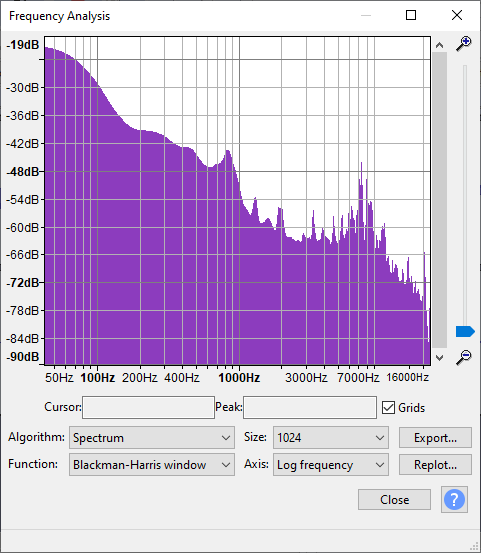

# FFTDenoiseRMS

Draft project

Subtract average wav file spectrum from another using FFT. For example substract average background noise from recording.

Push the «Draw Test Data» button and listen bin\Debug\denoise.wav

# Example
## Recordings

Signal provided by IKEA LED lamp

### Noise [noise.wav](FFTDenoiseRMS/audio_samples/noise.wav)

### Signal [sig.wav](FFTDenoiseRMS/audio_samples/sig.wav)

## After substraction
### Signal - Noise -10dB  [denoise-10dB.wav](FFTDenoiseRMS/audio_samples/after_denoise/denoise-10dB.wav)

### Signal - Noise -20dB [denoise-20dB.wav](FFTDenoiseRMS/audio_samples/after_denoise/denoise-20dB.wav)

### Signal - Noise -30dB [denoise-30dB.wav](FFTDenoiseRMS/audio_samples/after_denoise/denoise-30dB.wav)

